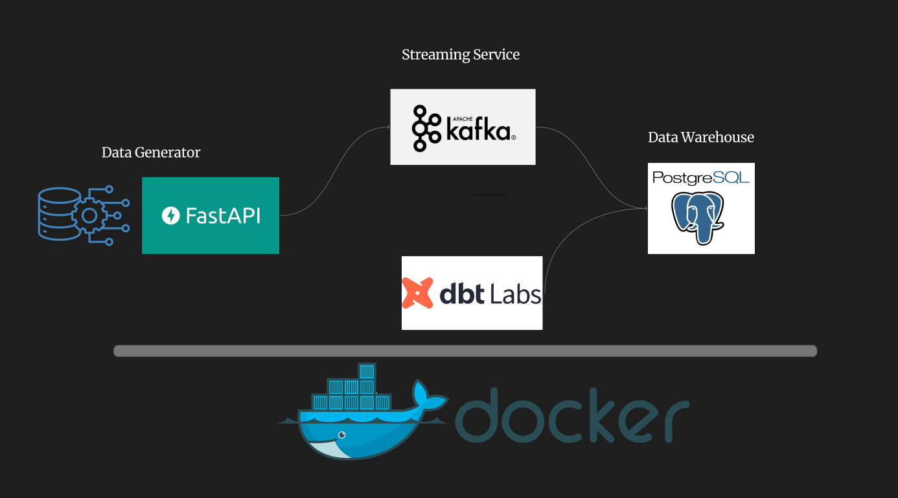

#  SalesPulse Data Pipeline


This project provides a robust and scalable data pipeline solution for processing and analyzing near real-time sales data. The goal is to cover the entire process, from initial data generation (FastAPI) through the streaming service (Kafka) to modeling within the Data Warehouse (PostgreSQL) using dbt.


## Data Pipeline




---

## 🛠Technologies Used

This data pipeline is built using the following core technologies:

* **Python / FastAPI:** Used for initial data generation and/or API services (Data Generator).
* **Apache Kafka:** A high-performance message broker for managing the data stream (Streaming Service).
* **PostgreSQL:** Serves as the Data Warehouse for storing clean and transformed data.
* **dbt (Data Build Tool):** Used for data modeling and transformations within PostgreSQL.
* **Docker / Docker Compose:** For easily setting up and managing all project components through containerization.

---

##  File Structure

The main project folders and their roles:

| Folder | Description |
| :--- | :--- |
| `dbt/` | The dbt (Data Build Tool) project. Contains all transformation models and configurations. |
| `docs/` | Documentation, diagrams, and explanatory materials, including the pipeline image (`images/pipeline.png`). |
| `fastapi_service/` | Code and dependencies for the FastAPI application. Can act as an initial data source. |
| `pg-data/` | Used to store PostgreSQL data or initial database setup scripts (e.g., table creation). |
| `producer/` | Scripts for sending data to Kafka. This is where **`syntheticproducer.py`** is located. |
| **`docker-compose.yml`** | The main configuration to launch all services (Kafka, Postgres, FastAPI, dbt). |
| **`requirements.txt`** | Python dependencies for the project. |
| **`mkdocs.yml`** | Configuration for generating documentation, if using `mkdocs`. |

---

##  Local Setup and Run

To run the project locally, make sure you have **Docker** and **Docker Compose** installed on your system.

1.  **Clone the Repository:**
    ```bash
    git clone https://github.com/dataeng-begineers/SalesPulse.git
    cd SalesPulse
    ```

2.  **Start the Components:**
    All services (`Kafka`, `PostgreSQL`, `FastAPI`, etc.) are defined in the `docker-compose.yml` file.
    ```bash
    docker-compose up --build -d
    ```

    > **Note:** It may take a few minutes for all containers (especially Kafka and PostgreSQL) to start completely. Check the logs: `docker-compose logs -f`.

3.  **Start Data Production:**
    If the code in `producer/syntheticproducer.py` is set up to send data to Kafka, data will automatically start streaming once this container is running.

4.  **Execute dbt Transformations:**
    After the data is written to PostgreSQL, run dbt to model the data:
    ```bash
    # Find the name of the dbt service container (usually 'dbt' or 'transformer')
    docker exec [dbt_container_name] dbt run
    
    # To execute tests:
    docker exec [dbt_container_name] dbt test
    ```
---

